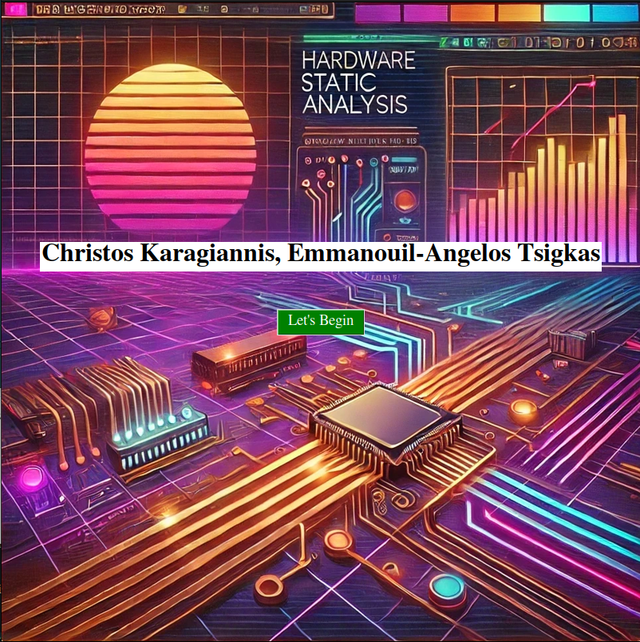

# Hardware Static Analysis Tool (HSAT)

**HAST** is a Python-based graphical utility designed to evaluate a system's vulnerability to various side-channel and hardware-level attacks. Developed by Christos Karagiannis and Emmanouil-Angelos Tsigkas, it provides an automated interface to compile and execute well-known Proof-of-Concept (PoC) exploits and visualize the results.



## 🚀 Features

* **Integrated Suite**: A unified GUI for selecting and executing multiple hardware security benchmarks simultaneously.
* **Real-time Analysis**: Automates the `make` and execution process for various C/C++ based exploits.
* **Visual Feedback**: Provides graphical output for Cache Side-Channel and SPOILER attacks using `matplotlib` to plot timing data.
* **Vulnerability Detection**: Scans output logs for specific signatures (e.g., "Success", "Memory access violation!") to determine the vulnerability status of the host machine.

## 🛡️ Supported Attacks

The tool integrates several industry-standard security research repositories:

* **Spectre (v1 & v2)**: Evaluates speculative execution vulnerabilities.
* **Meltdown**: Tests for unauthorized kernel memory access.
* **Rowhammer**: Checks for bit-flipping vulnerabilities in DRAM.
* **ZombieLoad**: Analyzes microarchitectural data sampling (MDS) vulnerabilities.
* **Prime+Probe**: Analyzes L1/L3 cache side-channels via single-eviction testing.
* **SPOILER**: Analyzes proprietary address speculation in CPUs.

## 🛠️ Requirements

* **OS**: Linux (required for hardware-level access, `taskset` CPU pinning, and POSIX compliance).
* **Python 3.x**.
* **Python Libraries**: `tkinter`, `PIL` (Pillow), `numpy`, and `matplotlib`.
* **Compilers**: `gcc`, `g++`, and `make` must be installed to compile the PoC binaries.

## 📁 Project Structure

For the tool to function correctly, the following directory structure is expected:

```text
.
├── HAST.py                 # Main Python script
├── links.txt               # The git repos of the PoC attacks that this project is based on 
├── imgs/                   # UI Assets
└── Attacks.zip/            # The zip folder containing the PoC attacks
